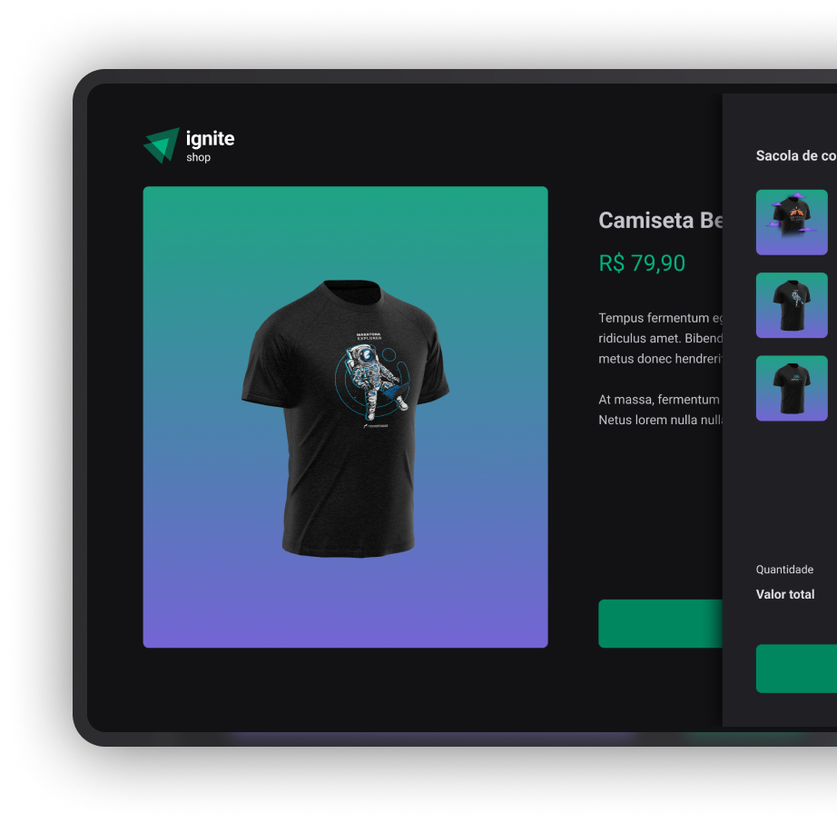

# ignite Shop

## Description
<h1 align="center">
    <a href="https://pt-br.reactjs.org/">🔗 React</a>
</h1>

🚀Projeto desenvolvido como solucao do desafio da trilha Ignite React.js da Rocketseat, sobre fundamentos do Next.js.

## Warnning

To simulate the purchase via stripe, please use the following card number for simulation:

code: 4242 4242 4242 4242 💳💳💳💳💳💳💳💳💳

the remaining data is your choice.

<h1 align="center">
  
</h1>

### 🛠 Technologies

The following tools were used to build the project:

- [TypeScript](https://www.typescriptlang.org/) 
- [Radix-ui](https://www.radix-ui.com/primitives) 
- [Redux Toolkit](https://redux-toolkit.js.org/) 
- [Stiches](https://stitches.dev/) 
- [Axios](https://axios-http.com/ptbr/docs/intro) 
- [Keen slider](https://keen-slider.io) 
- [Lucidde React](https://lucide.dev) 
- [Next.js](https://nextjs.org)
- [next-redux-wrapper](https://github.com/kirill-konshin/next-redux-wrapper)
- [react-redux](https://github.com/reduxjs/react-redux) 
- [Stripe](https://github.com/stripe/stripe-node) 

